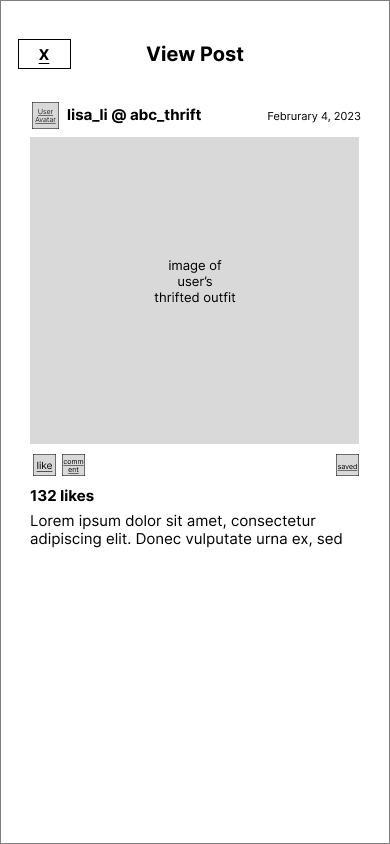
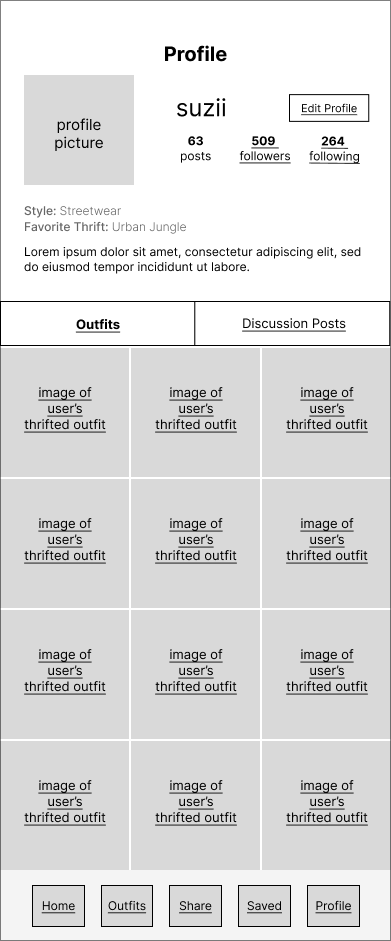

# User Experience Design

<!-- This repository contains instructions and files for two assignments that together comprise the user experience design phase of a web app.

Replace the contents of this file with the completed assignments, as described in: -->

<!-- - [app map & wireframe instructions](instructions-0a-app-map-wireframes.md).
- [prototype instructions](instructions-0b-prototyping.md) -->

<!-- For the wireframe diagrams, include the title of each diagram, as well as a simple explanation of the purpose of the screen it represents.
Any functionality of the screen that is not obvious should be written into the document. -->

## **Create Account & Home )**

---

## **Outfit Collection & Post Comment )**
### Outfit Collection :
  
- User can view collected posts of outfits posted by other users. 
- User can filter the posts by style. For example, if one clicks on "Streetwear", posts related to "Streetwear" should be displayed.
- User can click image to view the entire post.

### View Post :
  
- User can view, leave heart, comment, or save other's posts.
- User can exit the page by clicking the top-left "X" button.

### Comment Section :
  
- Displays comments posted under a specific post.
- User can reply to the post itself or the comment by clicking "Post Comment" or "Comment" button respectively.
- User can leave heart to comments.
- User can exit the page by clicking the top-left "X" button.

### Post Comment :
  
- Overlay appears when user clicks on "Post Comment" button in the Comment Section.
- User can type one's comment and post to engage in other's post. 
User can exit the page by clicking the top-left "X" button.

---
## Share Outfit 

---
## Saved Items & Discussion Posts

---
## **View and Edit User Profile )**
## View User's Own Profile: Outfits Version:
  
- User can view their own profile, which includes a profile picture, a bio, and their uploaded
outfits.
- User can click "Discussion Posts" to view their uploaded discussion posts instead of their outgits.
- User can click image to view the entire post.
- Overlay appears when user clicks on "Edit Profile" button. 

## Edit Profile :
  
- User can edit certain profile features, including their username, style, favorite thrift, and
biography.
- User can type in new responses for each feature.
- User can change their profile picture by clicking the "+" button at the top of the screen.
- The user can either click the "Done" button at the top right to save changes and exit,
or the "X" button at the top left to discard changes and exit. 

## View Another User's Profile (Outfits) :
  
- User can view another user's profile and their profile features, like their profile picture,
bio, and uploaded outfits.
- User can click "Discussion Posts" to view uploaded discussion posts instead of outfits.
- User can click image to view entire post.
- User can click the "Follow" button next to follow the user.

## View Another User's Profile (Discussion Posts):
  
- User can view the uploaded discussion posts of a profile rather than outfits.
- User can click the "Outfits button to return to viewing the profile's outfits.
