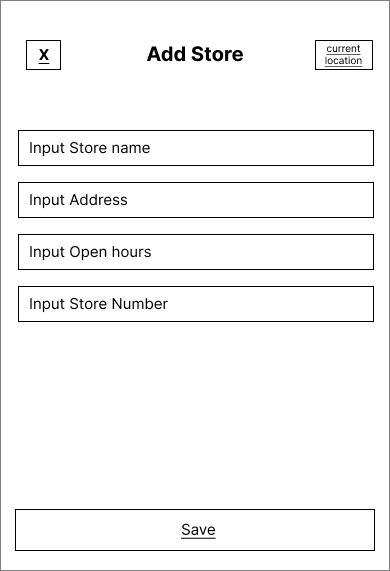

# User Experience Design

<!-- This repository contains instructions and files for two assignments that together comprise the user experience design phase of a web app.

Replace the contents of this file with the completed assignments, as described in: -->

<!-- - [app map & wireframe instructions](instructions-0a-app-map-wireframes.md).
- [prototype instructions](instructions-0b-prototyping.md) -->

<!-- For the wireframe diagrams, include the title of each diagram, as well as a simple explanation of the purpose of the screen it represents.
Any functionality of the screen that is not obvious should be written into the document. -->

## **Create Account & Home )**

---

## **Outfit Collection & Post Comment )**

### Outfit Collection :

  

- User can view collected posts of outfits posted by other users.
- User can filter the posts by style. For example, if one clicks on "Streetwear", posts related to "Streetwear" should be displayed.
- User can click image to view the entire post.

### View Post :

  

- User can view, leave heart, comment, or save other's posts.
- User can exit the page by clicking the top-left "X" button.

### Comment Section :

  

- Displays comments posted under a specific post.
- User can reply to the post itself or the comment by clicking "Post Comment" or "Comment" button respectively.
- User can leave heart to comments.
- User can exit the page by clicking the top-left "X" button.

### Post Comment :

  

- Overlay appears when user clicks on "Post Comment" button in the Comment Section.
- User can type one's comment and post to engage in other's post.
  User can exit the page by clicking the top-left "X" button.

---

## Share Outfit

### Share outfit

  

- Displayed when user decides to create a post to appear on feed
- User can choose to select video(s) and photo(s)
- User presses "Style", which takes them to the Choose Style page
- User presses "Add Location" which takes them to the Add Location Page
- User can type a caption to be published
- Pressing "Post" will publish the outfit onto their feed and onto their profile
- Pressing "x" will exit the Share Outfit page

### Choose style

  

- Displayed when User chooses to select a style that best describes the outit on the Share Outfit Page
- User can search for an existing style to choose from list, or choose from a list of all styles
- Published alongside the image(s) chosen by the User

### Choose location

  

- Displayed when User chooses to select a location on the Share Outfit Page
- User can search from saved location or from current location (using the Arrow on the upper right-hand corner)
- User can also choose to add a store
- Pressing "x" will take the user back to the previous page (Share Outfit)
- Published alongside the image(s) chosen by the User

### Add Location (Overlay)

  

- Displayed as an overlay when User chooses to add a location on the Choose Location Page
- User inputs store name, address, open hours, and the business phone number
- User can use current location to input store details (using the Arrow on the upper right-hand corner)
- Pressing "x" will close the overlay (displaying the Choose Location Page)
- User can save the new location using the "Save" button
- Published alongside the image(s) chosen by the User

## Saved Items & Discussion Posts

---

## View & Edit User Profile
