# User Experience Design

<!-- This repository contains instructions and files for two assignments that together comprise the user experience design phase of a web app.

Replace the contents of this file with the completed assignments, as described in: -->

<!-- - [app map & wireframe instructions](instructions-0a-app-map-wireframes.md).
- [prototype instructions](instructions-0b-prototyping.md) -->

> ## [View HighVintage Prototype on Figma](https://www.figma.com/proto/MKhYma12o2g2J1nhqxpeYV/HighVintage-Prototype?node-id=66%3A492&scaling=scale-down&page-id=0%3A1&starting-point-node-id=64%3A197&show-proto-sidebar=1)

 
 

# [App Map](https://bit.ly/3Ihz7To)
  
 

# [Wireframes](https://bit.ly/3YSVANI)

## **Create Account & Home )**

### Create Account :

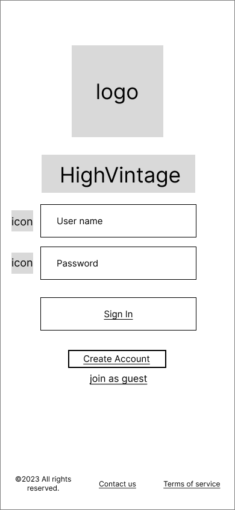

- This is the first page you see when you get on the site.
- User can login or create an account if they don't already have one.
- User can also join as guest without loging in but can't see past likes or save their collections
- User can see the terms of service or the contact page by clicking on the buttons at the bottom

### Contact Us :

- User can contact the site either through phone or email.
- User can click the x or the logo to go back to login page or the main home page if they were on it before.

### Terms of Service :

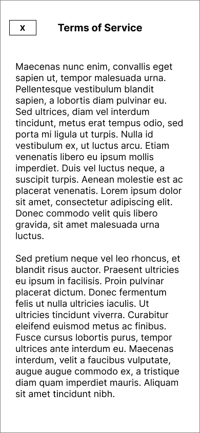

- User can read the terms of service on this page.
- User can click the x to go back to login page or main home page if they were on it.

###  Home :

- This is the main home page where the user can view posts from other users or travel to other pages through the menu bar at the bottom.
- User can click on other user's profile and view their profile.
- User can use the search bar to find posts or profiles related to the searched words.
- User can click on the "Ask Highvintager" button to go to the discussion post page.
- User can like and comment on other user's posts similar to other social media apps.
- User can save posts to refer to them later.
- User can click the button in the bottom menu bar to toggle between different pages.

---

## **Outfit Collection & Post Comment )**

### Outfit Collection :

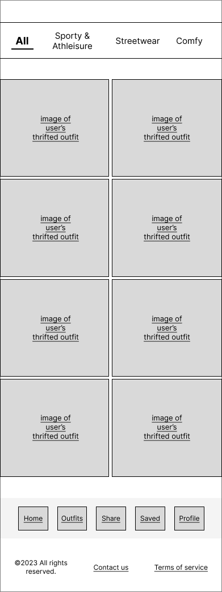  

- User can view collected posts of outfits posted by other users.
- User can filter the posts by style. For example, if one clicks on "Streetwear", posts related to "Streetwear" should be displayed.
- User can click image to view the entire post.
- User can click the button in the bottom menu bar to toggle between different pages.

### View Post :

  

- User can view, leave heart, comment, or save other's posts.
- User can exit the page by clicking the top-left "X" button.

### Comment Section :

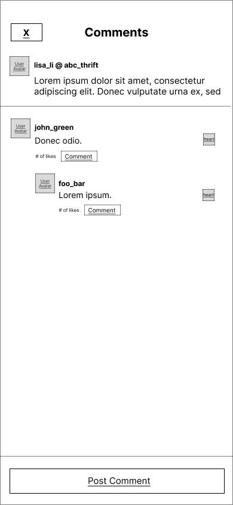  

- Displays comments posted under a specific post.
- User can reply to the post itself or the comment by clicking "Post Comment" or "Comment" button respectively.
- User can leave heart to comments.
- User can exit the page by clicking the top-left "X" button.

### Post Comment (Overlay) :

   

- Appears when user clicks on "Post Comment" button in the Comment Section.
- User can type one's comment and click "Post" button to engage in other's post.
- User can exit the page by clicking the top-left "X" button.

---

## **Share Outfit )**

### Share outfit :

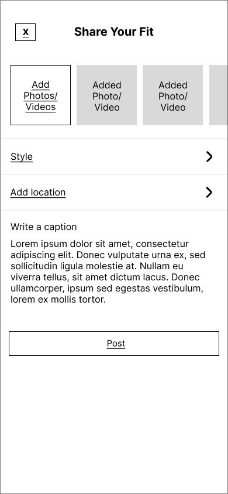  

- Displayed when user decides to create a post to appear on feed
- User can choose to select video(s) and photo(s)
- User presses "Style", which takes them to the Choose Style page
- User presses "Add Location" which takes them to the Add Location Page
- User can type a caption to be published
- Pressing "Post" will publish the outfit onto their feed and onto their profile
- Pressing "x" will exit the Share Outfit page

### Choose style :

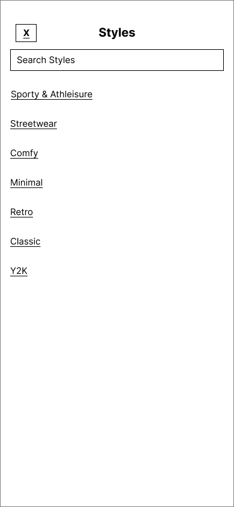  

- Displayed when User chooses to select a style that best describes the outit on the Share Outfit Page
- User can search for an existing style to choose from list, or choose from a list of all styles
- Published alongside the image(s) chosen by the User

### Choose location :

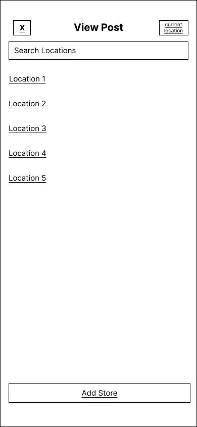  

- Displayed when User chooses to select a location on the Share Outfit Page
- User can search from saved location or from current location (using the Arrow on the upper right-hand corner)
- User can also choose to add a store
- Pressing "x" will take the user back to the previous page (Share Outfit)
- Published alongside the image(s) chosen by the User

### Add Location (Overlay) :

  

- Displayed as an overlay when User chooses to add a location on the Choose Location Page
- User inputs store name, address, open hours, and the business phone number
- User can use current location to input store details (using the Arrow on the upper right-hand corner)
- Pressing "x" will close the overlay (displaying the Choose Location Page)
- User can save the new location using the "Save" button
- Published alongside the image(s) chosen by the User

---
## **Saved Items & Discussion Posts )**

### Saved Items :
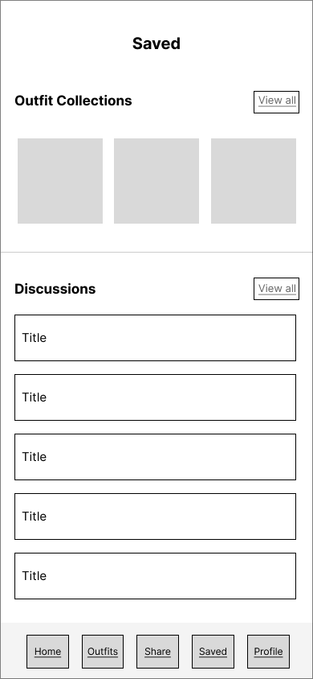  
- Displays saved outfit posts and discussion threads with titles.
- Press "View All" to see an expanded view of the discussions or collections saved.
- User may click on individual item and post to see their details.

### Saved Outfit Collections:
  
- Displays expanded view of the saved outfit collections.
- User may click on listed outfits pictures to view the original post.
- User can return to the previous the page by clicking the top-left "X" button.

### Saved Discussions:
  
- Displays expanded view of the saved discussions with titles and an overview of the post.
- User may click on listed discussions to view the original post.
- User can return to the previous the page by clicking the top-left "X" button.

### Discussion Feed :
  

- Displays discussion posts with author information, date, title, and a pre-view of the post.
- User can search for posts using the search bar "search HighVintage" at the top.
- User may sort discussion posts by most recent or most popular using the "Most Recent" and "Most Popular" button.
- Like a discussion post by clicking on "Like" button.
- Leave comments for a post by clicking on "Comment". User will enter the comment section of the post.
- Post new discussion posts using the "post" button at the bottom.

### Post Discussion :
  

- Displays a form that requires title and the text of a discussion post.
- User can return to the previous the page by clicking the top-left "X" button.
- Click on "Post" to post the current discussion

### View Discussion:
  
- Displays an specific example discussion post with a comment section.
- Click on "Post Comment" to post new comments to the original post 
- Click on "Comment" to comment under other's comments.
- User can like a comment with the "like" button aligned to the right of each comment.
- User can return to the previous the page by clicking the top-left "X" button.

---
## **View and Edit Profiles )**
### View User's Own Profile (Outfits Version):
  

- User can view their own profile, which includes a profile picture, a bio, and their uploaded outfits.
- Users can click the "Followers" button to view who follows them, or the "Following" button to view accounts they follow. 
- User can click "Discussion Posts" to view their uploaded discussion posts instead of their outfits.
- User can click image to view the entire post.
- User can click "Edit Profile" button to change profile features.

### View User's Own Profile (Discussion Posts Version):
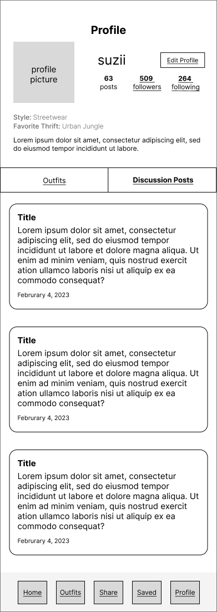  

- User views their own profile with their uploaded discussion posts.
- User can click "Discussion Posts" to view their uploaded discussion posts instead of their outfits.
- User can click discussion post to view the entire post.
- User can click "Edit Profile" button to change profile features.

### Edit Profile :
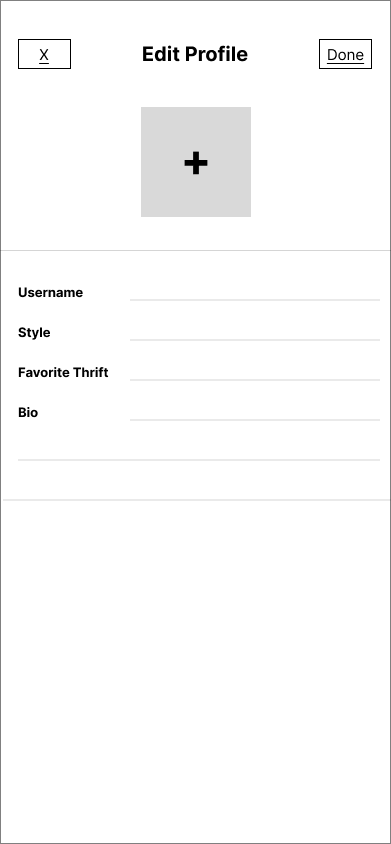  

- User can edit certain profile features, including their username, style, favorite thrift, and biography.
- User can type in new responses for each feature.
- User can change their profile picture by clicking the "+" button at the top of the screen.
- The user can either click the "Done" button at the top right to save changes and exit, or the "X" button at the top left to discard changes and exit. 

### View Another User's Profile (Outfits) :
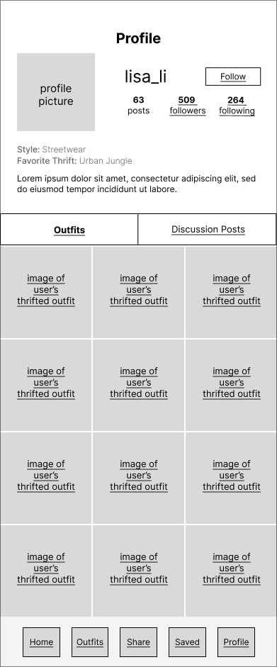  

- User can view another user's profile and their profile features, like their profile picture, bio, and uploaded outfits.
- Users can click the "Followers" button to view who follows this account, or the "Following" button to view  accounts this account follows. 
- User can click "Discussion Posts" to view uploaded discussion posts instead of outfits.
- User can click image to view entire post.
- User can click the "Follow" button next to follow the user.

### View Followers :
  

- User can vertically scroll through list of accounts who follow the page they are currently visiting.

### View Following :
  

- User can vertically scroll through list of accounts who the page they are currently visiting follow.
