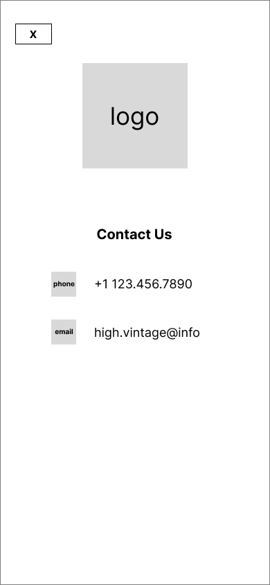
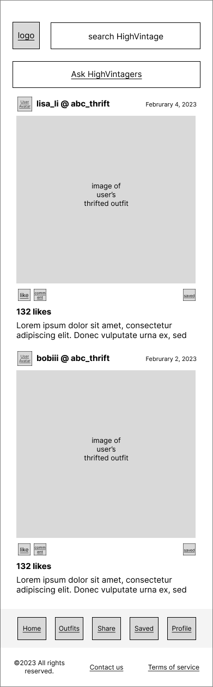
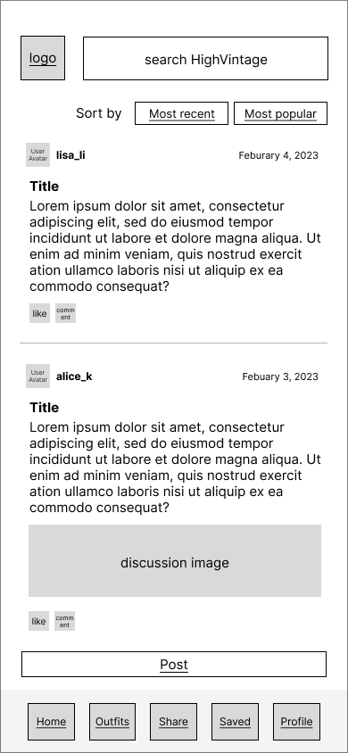

# User Experience Design

<!-- This repository contains instructions and files for two assignments that together comprise the user experience design phase of a web app.

Replace the contents of this file with the completed assignments, as described in: -->

<!-- - [app map & wireframe instructions](instructions-0a-app-map-wireframes.md).
- [prototype instructions](instructions-0b-prototyping.md) -->

<!-- For the wireframe diagrams, include the title of each diagram, as well as a simple explanation of the purpose of the screen it represents.
Any functionality of the screen that is not obvious should be written into the document. -->

## **Create Account & Home )**
### Login Page

- User will first be met with this page if they were never on the site before.
- User can either sign in if they have an existing account or be able to create account
- User can also just view the site as a guest but won't be able to use features such as saving posts and likes.
- User can view contact info or view the terms of services.

### Contact Us Page

- User will be able to contact the site through either phone or email.
- User can click either the x or the logo button to go back to login page or the main page.

### Terms of Service

- User can view the terms of service.
- User can click the x to go back to the login or main home page.

### Main Home Page

- User can view the main home page here with all the posts related to your interest or from your follows.
- User can view posts related to thrifting from other users here.
- User can click on their profile names to visit their profile page.
- User can click on search and search items or other users to see related posts.
- User can like and comment on other people's post similar to other social medias.
- User can also save posts
- User can click on the ask Highvintager button to go to the discussion page.

---

## **Outfit Collection & Post Comment )**
### Outfit Collection :
  
- User can view collected posts of outfits posted by other users. 
- User can filter the posts by style. For example, if one clicks on "Streetwear", posts related to "Streetwear" should be displayed.
- User can click image to view the entire post.

### View Post :
  
- User can view, leave heart, comment, or save other's posts.
- User can exit the page by clicking the top-left "X" button.

### Comment Section :
  
- Displays comments posted under a specific post.
- User can reply to the post itself or the comment by clicking "Post Comment" or "Comment" button respectively.
- User can leave heart to comments.
- User can exit the page by clicking the top-left "X" button.

### Post Comment :
  
- Overlay appears when user clicks on "Post Comment" button in the Comment Section.
- User can type one's comment and post to engage in other's post. 
User can exit the page by clicking the top-left "X" button.

---
## Share Outfit 

---
## Saved Items & Discussion Posts

### Saved Items:
  
- User can view their saved outfit posts and discussion threads in the "Saved" page. 
- Press "View All" to see an expanded view of the discussions or collections saved.
- User may click on individual item and post to see their details.
- Navigation bar is at the bottom of the screen.
- User can exit the page by clicking the top-left "X" button.

### Discussion Feed:
  
- Search for posts using the bar at the top.
- Displays discussion posts with author information, date, title, and a pre-view of the post.
- User may sort discussion posts by most recent or most popular.
- Like a post by clicking on the heart icon at the bottom left 
- Leave comments for a post by clicking on the message icon. User will enter the comment section of the post.
- Post new discussion posts using the "post" button at the bottom.

### Post Discussion:
  

- Displays a form that requires title and the text of a discussion post.
- User can return to the previous the page by clicking the top-left "X" button.

---
## View & Edit User Profile

